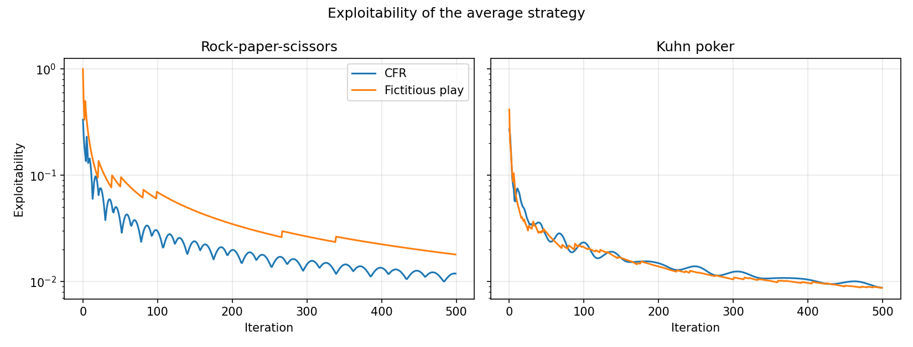

# Algorithmic Game Theory

Implementations of core algorithmic game theory algorithms from scratch, from
normal-form solution concepts up to Counterfactual Regret Minimization.

No game theory library is used: the game trees, the equilibrium measures and
the solvers are all built here on top of NumPy.



Both solvers drive exploitability towards zero. On Kuhn poker CFR reaches an
average strategy worth **-0.0556** to the first player, matching the known
game value of -1/18.

## What is implemented

**Normal form** (`agt/normal_form.py`)
- Expected value of a strategy profile, best response, NashConv, exploitability
- Iterated removal of strictly dominated actions
- Nash equilibria by support enumeration

**Extensive form** (`agt/extensive_form.py`)
- Game trees with information sets, chance nodes and per-history payoffs
- Reach probabilities, including counterfactual ones
- Expected value of a strategy profile

**Solvers**
- Best response and exploitability in extensive-form games (`agt/best_response.py`)
- Fictitious play with realization weighting (`agt/fictitious_play.py`)
- Counterfactual Regret Minimization (`agt/cfr.py`)

**Games** (`agt/games.py`) — rock-paper-scissors and Kuhn poker, built as
extensive-form trees.

## Running it

```bash
pip install -e ".[dev]"
pytest                          # 32 tests
python examples/convergence.py  # regenerates the figure above
```

Solving a game:

```python
from agt.cfr import CounterfactualRegretMinimizer
from agt.games import kuhn_poker

game = kuhn_poker()
solver = CounterfactualRegretMinimizer(game)
exploitability = solver.run(iterations=5000)

print(exploitability[-1])                                   # ~0.003
print(game.calculate_player_values(solver.average_strategy()))
```

## Notes on correctness

The equilibrium measures are validated against values that can be checked
independently: the uniform equilibrium of rock-paper-scissors, the mixed
equilibrium of matching pennies, and the -1/18 value of Kuhn poker. Two
properties that are easy to get wrong are asserted directly in the tests —
exploitability is never negative, and an average strategy is always a valid
probability distribution.

CFR is a single recursive tree walk per iteration, which is what makes it
usable beyond toy trees. Fictitious play averages best responses weighted by
the probability of reaching each information set; without that weighting the
average is not a valid behavioural strategy and need not converge.

## Origin

Coursework for Modern Algorithmic Game Theory (NOPT021, Charles University,
2023–2024), taught by Martin Schmid. The original submissions were notebooks
and a pair of scripts; the `agt` package is a rewrite of that work into a
tested library.

The lecture slides and homework assignments under `docs/` are the course
material, written by Martin Schmid and reproduced here for context. Everything
in `agt/`, `tests/` and `examples/` is my own.
